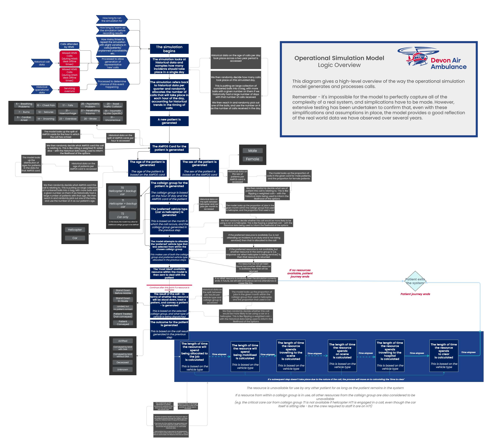

# Devon Air Ambulance Discrete Event Simulation

This repository contains all model and web app code for the Devon Air Ambulance Simulation modelling project.


## DES model logic

The model creates patient episodes and associated outcomes based on the following sequence:

1.  Obtain AMPDS card category based on hour of day
2.  Choose a callsign based on activation criteria, which helicopter (if any) is available, whether helicopter can currently fly (servicing or weather impacts),
3.  Based on callsign, determine the HEMS result (Stand Down Before Mobile, Stand Down En Route, Landed but no patient contact, Patient Treated (Not Conveyed), Patient Conveyed)
4.  Based on the HEMS result determine the patient outcome (Airlifted, Conveyed by land with DAA, Conveyed by land without DAA, Deceased, Unknown)

A full breakdown of the model logic can be found in **reference/daa_des_model_logic**



## Issue Tracking and Roadmap

Project issues are tracked using the Github issues system and can be accessed [here](https://github.com/RichardPilbery/DAA_DES/issues).

Project milestones can be found [here](https://github.com/RichardPilbery/DAA_DES/milestones?direction=desc&sort=title&state=open).

These project milestones currently supersede information contained in the `roadmap.md` file.

Tickets actively being worked on by contributors can be found on the [project board](https://github.com/users/RichardPilbery/projects/1).


## API Documentation

The function and class documentation can be accessed at the following link: [https://richardpilbery.github.io/DAA_DES/](https://richardpilbery.github.io/DAA_DES/)

This documentation is automatically generated using [pdoc](https://pdoc.dev/) and will be regenerated when the code is updated on the main branch on Github. If you are a contributor and wish to see

It is also available as part of the enhanced documentation offering available at [bergam0t.quarto.pub/air-ambulance-simulation/](https://bergam0t.quarto.pub/air-ambulance-simulation/).

## Data output items

The model generates a CSV file containing raw data, which can then be wrangled and presented separately, either following a model run(s) or at any time after the model has been run.

**All** runs of the model get added to the **all_results.csv** file.

The last run - whether run by the functions in can be found in the **run_results.csv** file.

The table below identifies the column headers and provides a brief description

| Column name               | Description |
| --------------------------| ------------------------------------------------------------------------------ |
| P_ID                      | Patient ID    |
| run_number                | Run number in cases where the model is run repeatedly (e.g. 100x) to enable calculations of confidence intervals etc.|
| time_type                 | Category that elapsed time represents e.g. 'call start', 'on scene', 'leave scene', 'arrive hospital', 'handover', 'time clear'|
| timestamp                 | Elapsed time in seconds since model started running |
| day                       | Day of the week as a string ('Mon', 'Tue', 'Wed', 'Thu', 'Fri', 'Sat', 'Sun') |
| hour                      | Hour of call as integer between 0–23 |
| weekday                   | String identifying whether the call started on a weekday or weekend |
| month                     | Integer representing the month of the year (1–12) |
| qtr                       | Integer representing the yearly quarter of the call (1–4) |
| callsign                  | String representing callsign of resource (either HEMS or Ambulance service) |
| triage_code               | Call triage outcome represented as one of the AMPDS 'golden' codes (or OTHER) |
| age                       | Integer representing patient age in years |
| sex                       | String representing patient sex ('male', 'female') |
| time_to_first_response    | Integer representing time in minutes to first response (ambulance service or HEMS) |
| time_to_cc                | Integer representing time in minutes to first HEMS response |
| cc_conveyed               | Integer indicating whether HEMS conveyed patient (1 or 0) |
| cc_flown                  | Integer indicating whether HEMS conveyed the patient by air (1 or 0) |
| cc_travelled_with         | Integer indicating whether patient was conveyed by ambulance but HEMS personnel travelled with the patient to hospital (1 or 0) |
| hems                      | Integer indicating whether HEMS attended the incident (1 or 0) |
| cc_desk                   | Integer indicating whether HEMS activation was due to critical care desk dispatch |
| dispatcher_intevention    | Integer indicating whether the ambulance service dispatcher activated HEMS for a called which did not meet auto-dispatch criteria (1 or 0) |

## Environment Setup

### Installing the project locally

Clone this repository to your machine.

The core environment is provided in the `requirements.txt` file in the root folder of the repository.

This has been used in conjunction with Python 3.11.9.

Using your preferred virtual environment manager, install the requirements specified in `requirements.txt`.

When you have completed this, you will need to undertake one additional step; installing the air ambulance simulation code.

This is achieved by running `pip install -e .`

> [!IMPORTANT]
> Be sure to run this command from the root of the repository (the folder containing pyproject.toml and requirements.txt).

This installs the air ambulance simulation code as an *editable package*. This means that any changes to the classes and functions in the folder `air_ambulance_des` will automatically be recognised in the web app or anywhere else you call the code from while using this environment, without needing to reinstall the package.

This additional step is necessary because the simulation code is organised as a Python package (air_ambulance_des) rather than a set of standalone scripts. This supports long term reusability, testing and documentation workflows.

### Remote hosting

A devcontainer.json file has also been provided in the .devcontainer folder; this allows VSCode to access or create a container with the appropriate versions of Python and all requirements, including automatically installing the air ambulance simulation code as an editable package (so you will **not** need to set up a virtual environment or run `pip install -e .`).

Alternatively, you could open up the development environment in Github Codespaces, which will achieve the same purpose without you having to clone the repository and set up an environment on your local machine. To access this, ensure you are logged into GitHub, then look for the green 'Code' button at the top of this repository. Click on this and select 'Create codespace on main'.


You can find out more about codespaces at [github.com/features/codespaces](https://github.com/features/codespaces).

## Web App

Assuming you have installed the environment as above, either locally or in Github Codespaces, the web app can be run using the command

`streamlit run app/app.py`

The app will attempt to use multiple cores of the user's computer to undertake several runs of the model simultaneously.

The web app can also be accessed without needing to install anything at [daa-des-demo.streamlit.app/](https://daa-des-demo.streamlit.app/). However, not that this will run more slowly and will complete fewer runs by default due to limitations of the hosting platform (which prevents multi-core running); it is recommended to download the app and run it locally if you are not just looking to get an idea of the app's capabilities.

### Quarto

If you wish to be able to download the output from the web app as a Quarto file, you will need to also install Quarto.

Quarto can be downloaded at [https://quarto.org/docs/get-started/](https://quarto.org/docs/get-started/).

- It is recommended that, when asked by the installer, you add Quarto to your PATH variable.
- It is important to note that while a [Python package for quarto exists](https://pypi.org/project/quarto/), this is not the full Quarto command line utility, which will need to be installed separately.

Note that if you are using the .devcontainer, Quarto will be available within the container without undertaking any additional steps.

### Hosted version of web app

The Streamlit app is also available at the following link: [https://daa-des-demo.streamlit.app/](https://daa-des-demo.streamlit.app/)

Note that for permissions reasons, the hosted version of the app runs off a fork ((https://github.com/Bergam0t/DAA_DES)[https://github.com/Bergam0t/DAA_DES]) instead of this main repository.
Therefore, the hosted version may not always be the most up to date version of the app.

You can determine if the fork is currently up to date with this repository by navigating to the fork using the link above and looking at the following message.


Note that due to limitations of the hosting platform, each run of the model is undertaken sequentially, not in parallel, so execution times are much longer.

## Estimated Run Times

As of March 2025, the app has been tested on a pc with the following specs

- OS: Windows 11 (Version 10.0.22631 Build 22631)
- Processor: 12th Gen Intel(R) Core(TM) i7-12700H, 2300 Mhz, 14 Core(s), 20 Logical Processor(s)
- Installed Physical Memory (RAM): 32.0 GB

When executing the model through the streamlit interface, running locally so parallel processing can be used, the following run times were observed.

**2 years simulated time, default demand, default parameters (2 helicopters, 2 backup cars, 1 additional car)**

*including generation of all plots via web interface*

- **12 runs, 730 days:** ~2 minutes (~90 seconds for initial model running)
- **100 runs, 730 days:** ~8 minutes (~4 minutes for initial model running)


## Details for Contributors

Please refer to our code of conduct here: [CODE_OF_CONDUCT.md](CODE_OF_CONDUCT.md)

### Repository Structure

#### Root

#### actual_data

This folder contains key input data that is called upon by the model, pertaining to areas including rotas and servicing.

#### air_ambulance_des

The model logic is structured as a package in this folder.

**class_ambulance.py**:
This file defines the core resource class.

**class_hems_availability.py**:
This file contains classes controlling the logic around the allocation of resources to jobs.

**class_hems.py**:
This file defines the HEMS class as a child of the core resource class defined in class_ambulance.

**class_historic_results.py**
This file defines a class that allows for generation of metrics and plots relating to the historical data. This allows for comparison of the model with historic data in a number of ways.

**class_patient.py**:
This file defines the core patient class. The model uses a single patient class.

**class_simulation_inputs.py**:
This manages the data files that are handed to the simulation, ensuring they are made available to the historical data and simulation data classes to facilitate calculations.

**class_simulation_trial_results.py**:
This file defines a class that allows for generation of metrics and plots relating to the data generated by running the simulation.

**des_hems.py**:
This file is the key file controlling call generation and call journeys, and is where most of the logic relating to the patient journey is held.

**des_parallel_process.py**:
This file contains functions to perform a single run of the model, or multiple runs using parallel processing. It also handles the collation of results files and associated filespace cleanup.

*There are also several supporting files.*

**distribution_fit_utils.py**: This file contains functions and classes for fitting distributions from raw data. Note that instructions are currently not given for the required data format for using this on your own data. However, the distributions generated by these functions for the site the model is being developed for can be found in the *distribution_data* folder, allowing other parts of the app to be run in the absence of raw job-level data.

**utils.py**:
This file contains various supporting functions used across other files.

#### air_ambulance_des_docs

This folder contains various files related to the enhanced Quarto documentation for this model and app.
This does not contain the rendered output - only manually written documentation files, as well as configuration files to support the generation of the documentation.

#### app

This folder contains code relating to the generation of the interactive web app interface.

#### checklists

This folder contains

#### distribution_data

This folder contains the distributions that are generated from the call-level data and the module **air_ambulance_des.distribution_fit_utils**.

#### docs

This folder contains the pdoc documentation. Note that this is usually generated as part of an automated GitHub workflow, so this folder will usually be empty apart from a `.gitignore` file.

#### docs_quarto

This folder contains the rendered quarto documentation.

#### historical_data

This folder contains aggregated historical data.

This data is currently used to visualise the historical range of data and compare it with the simulated results.

The data will also be used as part of the pytest testing suite to ensure models run with the parameters in use at the time these simulations were run successfully mimic the observed real-world patterns.

#### readme_assets

This folder contains images used within this readme.

#### reference

This folder contains

If editing the files, you should use the .drawio versions, which can be opened with the free tool diagrams.net.

It is recommended that you edit and export the diagrams in light mode, and export using a 50 pixel border, to ensure a consistent appearance is maintained.

#### tests

This folder contains files that will be picked up by the pytest framework. They are planned to contain various tests including validation/verification tests, and unit tests.

To run all tests, use the command `pytest` in a terminal, running from the root folder of the project.

To run a subset of tests, you can choose subsets of tests. For example, to run all resource-related tests based on their tag (known as a marker), run `pytest -m resources`. More options can be seen [here](https://docs.pytest.org/en/stable/example/markers.html).

Markers available include:

```
    warmup: Tests relating to the warm-up period
    resources: Tests relating to the correct logic around resource allocation and unavailability
    calls: Tests relating to the number of calls/jobs generated
    jobdurations: Tests relating to the duration of jobs
    quick: Tests to quickly check the sim is functioning at a basic level
    reproducibility: Tests to check that random seeds behave as expected
    performance: Tests to check that basic metrics behave as expected when core parameters change
```

See `pytest.ini` for the most up-to-date list of markers.

You can also use `pytest -k some_string` to match tests with a name containing a particular string (replacing `some_string` in the command with your own search term).

Alternatively, see the [pytest documentation](https://docs.pytest.org/en/stable/how-to/usage.html) for additional ways to manage groups of tests.

To generate an interactive html report, run `pytest --html=report.html`

To generate a code coverage report, run `pytest --cov=. --cov-report=html`.

### Regenerating documentation

#### pdoc (basic class/function documentation)

In general, you will not to generate the pdoc documentation as this is controlled by a Github actions workflow (.github/docs.yml).

However, you may wish to do so for testing purposes or to preview the documentation without pushing changes - though note that your rendered/previewed version will be ignored by GitHub.

To regenerate pdoc documentation, ensure you are in the root of the repo (folder 'DAA_DES')

Then run `pdoc air_ambulance_des -o docs/`

This will output the pdoc documentation to the `docs/` folder.

To preview the documentation, navigate to this folder and open the file `index.html`.

The pdoc documentation is hosted on GitHub pages at [richardpilbery.github.io/DAA_DES/](https://richardpilbery.github.io/DAA_DES/)

#### quarto/quartodoc (basic class/function documentation + additional enhanced documentation)

To regenerate the quartodoc/quarto documentation, first make sure you have the quarto CLI installed and the quartodoc package installed in your environment (which should happen automatically if you have set up the environment from requirements.txt)

First, move into the folder `air_ambulance_des_docs`. If you are in the root of the repository, you can do this by running `cd air_ambulance_des_docs`.

Next, run `quartodoc build`. This will rebuild the sidebar and the autogenerated class and function documentation.

Then, run `quarto render`. This will fully render both the autogenerated quartodoc pages and all additional pages that are included.

If you wish to preview the finished documentation, run `quarto preview`. This will open a preview server. Depending on your IDE settings, this may open in a panel in the IDE, or it may open as a tab in your default web browser.

The quarto/quartodoc documentation is hosted on quartopub at [bergam0t.quarto.pub/air-ambulance-simulation/](https://bergam0t.quarto.pub/air-ambulance-simulation/).
