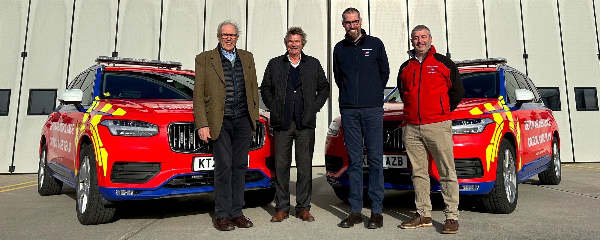

## Critical care cars

The critical care cars in operation are Volvo XC90s (4WD, high performance) that include a blue light response kit.

{width=600px}

Critical care cars are unable to undertake patient transport.

> "Whilst we are helicopter-led pre-hospital emergency service, these additional Critical Care Cars will give us the ability to modify our operational approach and target, for example, more populated areas of high demand, like our city centres.

> As we meet a growing need for the service more generally, having the scope and flexibility to tailor our emergency response will ultimately mean we can meet local needs and provide the best possible service for the people of Devon."

\- Head of Operations

> "Each Critical Care Car is equipped with the same specialist medical equipment and medicines as the Charity’s helicopters, so their highly skilled teams can deliver a range of advanced clinical interventions and procedures at the scene of the incident, helping to enhance patient outcomes and save lives."
