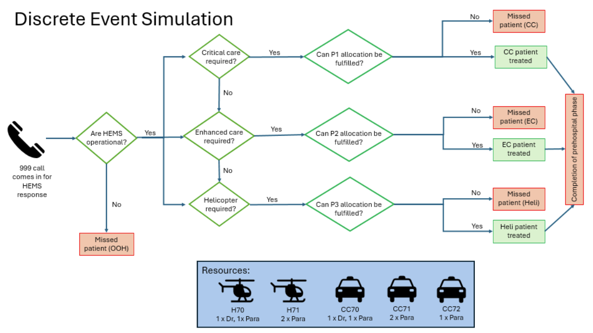
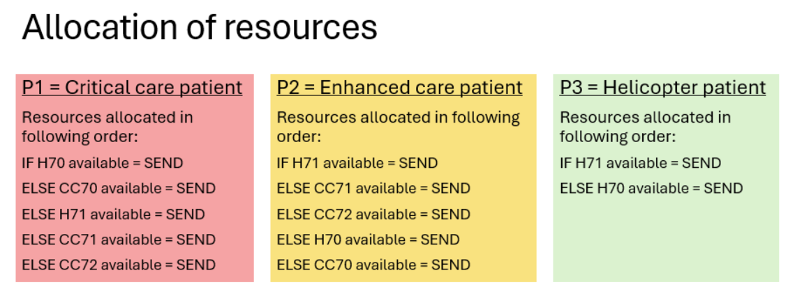

## Initial Version

## Version 2

:::{.callout-note}
Questions arising (SR)

## Operational questions

- Is current presence of doctor on only some calls due to the design of the older helicopter?

## Servicing questions

- How do servicing intervals/lengths vary across the different resources?
- How often does servicing extend beyond the planned timing, and by how much? Does this vary by helicopter type?

## Helicopter questions

- What is the maximum expected remaining operational life on that helicopter?
- What are the likely servicing costs of keeping the 135 running over the same period vs a new helicopter

:::
